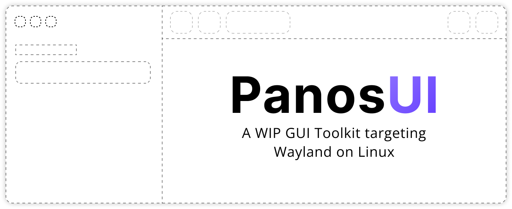

The main goal of PanosUI is to provide a GUI library by means of a C Library utilizing opaque data types. This is to provide a consistent interface for all platforms that are supported.

The architecture of this library should be such that you should never know what is going on under it. You should only ever interact with the methods that are exposed within the `include` directory. Any other use is unsupported.

As a client of the library:
* You should not know how the graphics stack is implemented.
* You should not know how it's being rendered to the screen.
* You should not know where the events are coming from.

# Structure

The following structure is sorted by how they build upon each other.

```
reference/
|-- Reference files are those that are not apart
    of the build, but are used as inspiration

src/
|-- linux - Platform specific Linux code
    |-- deps - Generated Wayland protocols
        |-- protocols - Raw Wayland XML protocols
                        for use with wayland-scanner

include/ - Public Headers for use by client executables

cpp/
|-- ui - C++ Headers that provide an idiomatic C++
         interface from the public headers

tests/
|-- Source files that will links panosui.lib to test
    the functionality 
```